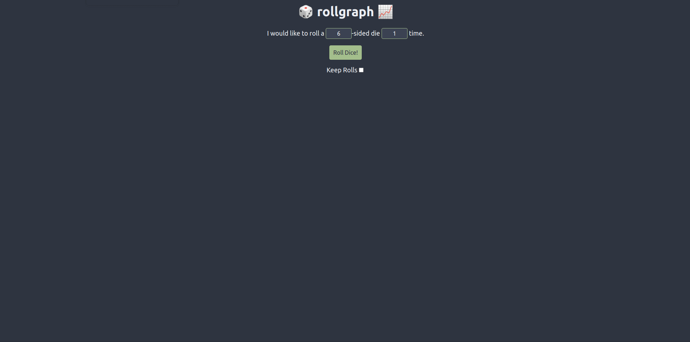

# 🎲 rollgraph 📈

Welcome to the repository of the website `rollgraph`. The live site can be found at https://davidherszenhaut.github.io/rollgraph/.

 

<p align="center">
  
</p>

## Table of Contents

- [About](#about)
- [Installation](#installation)
- [Contributing](#contributing)

## About

`rollgraph` is a website where users can simulate dice rolls. Users can decide how many faces each die has, how many dice they want to roll at a time, and whether or not previous rolls are saved. Once some roll data has been recorded, various data visualizations will be constructed based on that data.

## Installation

If you wish to install and run `rollgraph` locally, follow these steps:

1. Clone the repository

```bash
git clone https://github.com/davidherszenhaut/rollgraph.git
```

2. Go into the repository

```bash
cd rollgraph/
```

3. Install the dependencies

```bash
npm install
```

4. Start the project

```bash
npm start
```

`rollgraph` will now be running at `http://localhost:3000/rollgraph`

## Contributing

### Issues

If you run into any problems with `rollgraph` (live or locally), please feel free to create a new issue if you see that one does not already exist for your problem. Make sure to include as much information as possible in the body of the issue to make fixing the problem easier.

### Pull Requests

If you have written some code for a new feature or bug fix, please feel free to open a pull request, but make sure that an issue describing your new feature or bug fix exists first. Include a "closing" keyword somewhere in the body of your pull request so that it can be automatically linked to the related issue. For example, adding `Fixes #17` to the body of your pull request will link it to issue number 17 in the repository. When a pull request is created, a workflow will trigger with some checks that need to pass before merging. If you wish to run these checks locally before creating your pull request, you can use these commands:

- Prettier

```bash
npx prettier --check .
```

- ESLint

```bash
npx eslint . --ext .js,.jsx,.jts,.tsx
```

- Jest

```bash
npm run test
```

### Documentation

Documentation for the code is autogenerated using [TypeDoc](https://typedoc.org/). Once you have cloned the repository and installed its dependencies, run `npm run docs` and documentation will appear in the `/docs` directory.
